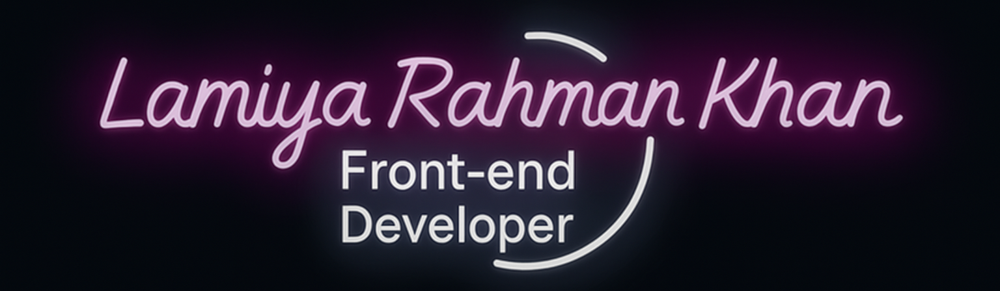

&nbsp;***About me***

I am a **Computer Science** student, currently halfway through my degree. I’m expanding my knowledge in both back‑end and front‑end development. I enjoy building creative and useful projects, and I’m always excited to explore new technologies.  
- 📚 Currently learning: *MongoDB*, *JWT*  
- 🚀 I’m eager to join new projects.  
- 📫 Reach out to me at: <a href="mailto:lamiyarahmankhan01@gmail.com">lamiyarahahmankhan01@gmail.com</a>

 
 

&nbsp; ***Skills***

## My Favorite Tools and Technologies ⚙️

> Tools and technologies that I have worked with and am interested in

<table>
  <tr>
    <td align="center" width="96">
        
       HTML
    </td>
    <td align="center" width="96">
        
       CSS
    </td>
    <td align="center" width="96">
        
       JavaScript
    </td>
    <td align="center" width="96">
        
       React
    </td>
    <td align="center" width="96">
        
       Tailwind
    </td>
    <td align="center" width="96">
        
       Firebase
    </td>
    <td align="center" width="96">
        
       JSON
    </td>
    <td align="center" width="96">
        
       Git
    </td>
    <td align="center" width="96">
        
       GitHub
    </td>
  </tr>
  <tr>
    <td align="center" width="96">
        
       REST API
    </td>
    <td align="center" width="96">
        
       Java
    </td>
    <td align="center" width="96">
        
       Python
    </td>
    <td align="center" width="96">
        
       C
    </td>
    <td align="center" width="96">
        
       C++
    </td>
    <td align="center" width="96">
        
       PHP
    </td>
    <td align="center" width="96">
        
       MongoDB
    </td>
    <td align="center" width="96">
        
       MySQL
    </td>
    <td align="center" width="96">
        
       NPM
    </td>
  </tr>
</table>

<!-- Github Stats -->
 
 
&nbsp;***Github Stats***

 

<table align="center">
<tr>
<td width="50%" align="center">
    
    
</td>
<td width="50%" align="center">
    
</td>
</tr>
</table>

 

<!-- Visitor Counter -->
 

    
    
    

 
 

