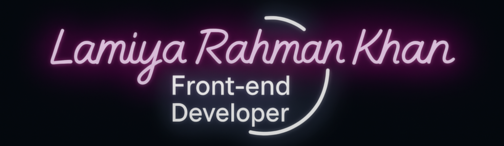
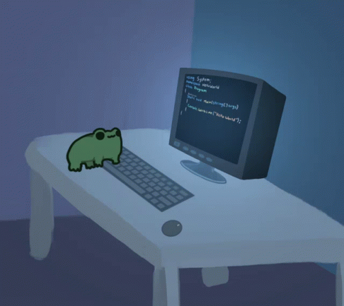

---

 

---

## About Me

I'm a **Computer Science** student, currently halfway through my degree, expanding my knowledge across back-end and front-end development. I enjoy building creative and useful projects, and I'm always excited to explore new technologies.

- 📚 Currently learning: **Next.js** · **TypeScript** . **React Native**
- 🚀 Eager to join exciting new projects
- 💡 Interested in full-stack development & competitive programming
- 📫 Reach me at: [lamiyarahmankhan01@gmail.com](mailto:lamiyarahmankhan01@gmail.com)

 

---

## Connect with Me

  
  
  
  

---

## ⚙️ Skills & Technologies

<table>
  <tr>
    <td align="center" width="80"> HTML</td>
    <td align="center" width="80"> CSS</td>
    <td align="center" width="80"> JavaScript</td>
    <td align="center" width="80"> React</td>
    <td align="center" width="80"> Tailwind</td>
    <td align="center" width="80"> Firebase</td>
    <td align="center" width="80"> Git</td>
    <td align="center" width="80"> GitHub</td>
    <td align="center" width="80"> Next.js</td>
  </tr>
  <tr>
    <td align="center" width="80"> Java</td>
    <td align="center" width="80"> Python</td>
    <td align="center" width="80"> C</td>
    <td align="center" width="80"> C++</td>
    <td align="center" width="80"> PHP</td>
    <td align="center" width="80"> MongoDB</td>
    <td align="center" width="80"> MySQL</td>
    <td align="center" width="80"> TypeScript</td>
    <td align="center" width="80"> NPM</td>
  </tr>
</table>

---

## GitHub Stats

<!-- GitHub Stats Card -->

<!-- Top Languages Card -->

 

<!-- GitHub Streak -->

  

 

<!-- Trophies -->

  

---

## Contribution Graph

---

##  Profile Visitors

---

*"The best way to predict the future is to invent it." – Alan Kay*

